<!--
  ┌───────────────────────────────────────────────────────────────┐
  │  UMAIR IQBAL · AGENT-OS                                       │
  │  Every panel below is an animated SVG rendered by             │
  │  scripts/generate.py from live GitHub data + scripts/config.json │
  │  Regenerates every 6h via .github/workflows/agent-os.yml      │
  │  Edit scripts/config.json — never the SVGs.                   │
  └───────────────────────────────────────────────────────────────┘
-->

<div align="center">

<a href="https://umairiqbal.com"></a>

</div>


<table>
<tr>
<td width="58%" valign="top">

```yaml
# ── flight computer ──────────────────────────
callsign:   Umair Iqbal
class:      AI Solutions Architect
vehicle:    design ⇄ engineering ⇄ automation
mode:       autonomous · human-in-the-loop
base:       TODO(location)
flight_hrs: TODO(years)

mission:
  - architect agent systems that do real work
  - collapse idea → prototype → product loops
  - make AI feel premium, not gimmicky

now:
  building:  TODO(current project)
  learning:  agent evals · long-horizon memory
  open_to:   consulting · collabs · talks
```

</td>
<td width="42%" valign="top">

<br/>

| | Flight rules |
|:-:|:--|
| `01` | **Outcome over output.** Ship the loop, not the demo. |
| `02` | **Agents need rails.** Evals, guardrails, observability. Always. |
| `03` | **Design is architecture.** UX calls are system calls. |
| `04` | **Tokens are fuel.** Less context, sharper burn. |
| `05` | **Automate the toil.** Humans keep the judgment. |

<sub>⟶ <a href="https://umairiqbal.com">umairiqbal.com</a> · <a href="mailto:hello@umairiqbal.com">hello@umairiqbal.com</a></sub>

</td>
</tr>
</table>







<picture>
  <source media="(prefers-color-scheme: dark)" srcset="https://raw.githubusercontent.com/UmairIqbal92/UmairIqbal92/output/github-snake-dark.svg" />
  <source media="(prefers-color-scheme: light)" srcset="https://raw.githubusercontent.com/UmairIqbal92/UmairIqbal92/output/github-snake-light.svg" />
  
</picture>





<details>
<summary>&nbsp;<code>▸ flight plan · reference architecture</code></summary>
<br/>

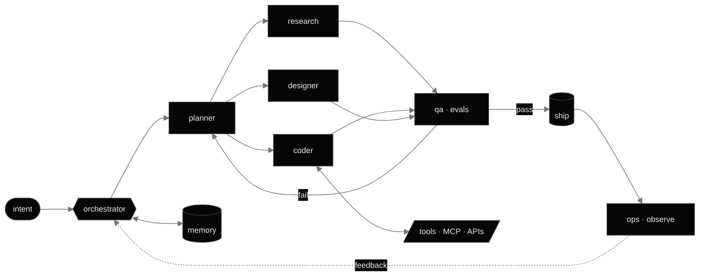

</details>



<!-- TODO(umair): pin real repos here. Pattern:
<a href="https://github.com/UmairIqbal92/REPO"></a>
-->


<!-- BLOG-POST-LIST:START -->
- 📡 Feed not linked yet — set `feed_list` in `.github/workflows/blog-posts.yml`
<!-- BLOG-POST-LIST:END -->



<div align="center">

<a href="https://umairiqbal.com"></a>
&nbsp;
<a href="mailto:hello@umairiqbal.com"></a>
&nbsp;
<a href="https://github.com/UmairIqbal92"></a>
&nbsp;


</div>

