<!--
  Every panel is an SVG rendered by scripts/generate.py from live GitHub data
  and scripts/config.json. Refreshes every 6h (.github/workflows/agent-os.yml).
  Edit scripts/config.json — never the SVGs.
-->

<picture>
  <source media="(prefers-color-scheme: dark)" srcset="https://raw.githubusercontent.com/UmairIqbal92/UmairIqbal92/output/github-snake-dark.svg" />
  <source media="(prefers-color-scheme: light)" srcset="https://raw.githubusercontent.com/UmairIqbal92/UmairIqbal92/output/github-snake-light.svg" />
  
</picture>

<!-- BLOG-POST-LIST:START -->
<!-- BLOG-POST-LIST:END -->

