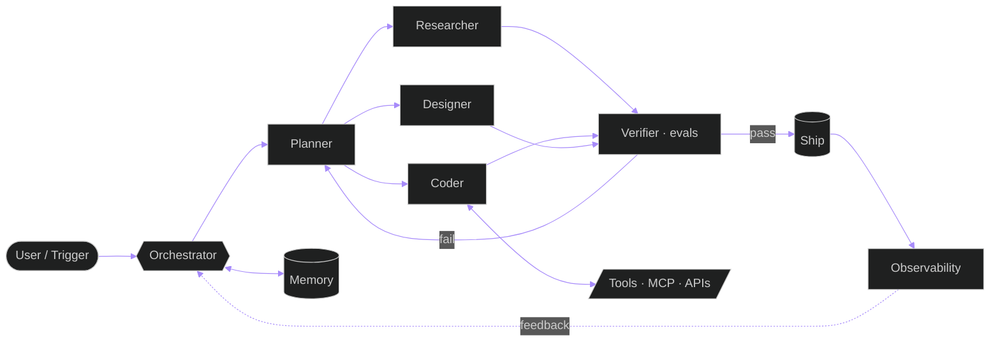

<!--
  ╔══════════════════════════════════════════════════════════════╗
  ║  UMAIR IQBAL · AGENT OS · profile README                     ║
  ║  Animated assets live in ./assets (self-hosted, no deps).    ║
  ║  Search "TODO" to fill in details as they are confirmed.     ║
  ╚══════════════════════════════════════════════════════════════╝
-->

<div align="center">



<br/>

<a href="https://umairiqbal.com">
  
</a>

<br/>

<a href="https://umairiqbal.com"></a>
&nbsp;
<a href="mailto:hello@umairiqbal.com"></a>
&nbsp;
<a href="https://github.com/UmairIqbal92"></a>
&nbsp;


</div>

<br/>

## `⟩ whoami`

<table>
<tr>
<td width="55%" valign="top">

```yaml
agent:
  name:      Umair Iqbal
  class:     AI Solutions Architect
  runtime:   design ⇄ engineering ⇄ automation
  mode:      autonomous · human-in-the-loop
  base:      TODO(location)
  uptime:    TODO(years) in the field

mission:
  - architect agent systems that do real work
  - compress idea → prototype → product loops
  - make AI feel premium, not gimmicky

currently:
  building:  TODO(current project)
  learning:  agent evals · long-horizon memory
  open_to:   consulting · collaborations · talks
```

</td>
<td width="45%" valign="top">

### Operating principles

| # | Directive |
|:-:|:--|
| 01 | **Outcome over output.** Ship the loop, not the demo. |
| 02 | **Agents need rails.** Guardrails, evals, observability, always. |
| 03 | **Design is architecture.** UX decisions are system decisions. |
| 04 | **Token efficiency is a feature.** Less context, sharper results. |
| 05 | **Automate the boring.** Humans handle judgment, agents handle toil. |

<sub>Reach me → <a href="mailto:hello@umairiqbal.com">hello@umairiqbal.com</a> · <a href="https://umairiqbal.com">umairiqbal.com</a></sub>

</td>
</tr>
</table>

<br/>

## `⟩ pipeline`

<div align="center">

</div>

<details>
<summary><b>▸ Reference architecture (expand)</b></summary>
<br/>



</details>

<br/>

## `⟩ agent.stack`

<div align="center">

**Intelligence layer**<br/>

&nbsp;


**Build layer**<br/>


**Automation & data**<br/>

&nbsp;


**Ship layer**<br/>


**Design layer**<br/>


<sub>TODO: prune / extend to match the real stack</sub>

</div>

<br/>

## `⟩ modules`

<div align="center">

| Module | Status | What it does |
|:--|:--:|:--|
| 🧭 **Planner** | `● online` | Breaks fuzzy goals into executable task graphs |
| 🔍 **Researcher** | `● online` | Grounds decisions in sources, not vibes |
| ⚙️ **Coder** | `● online` | Production-grade Python / Node, modular by default |
| 🎨 **Designer** | `● online` | Interfaces, brand systems, motion — pixel-accountable |
| 🛰️ **Ops** | `● online` | Deploys, monitors, and keeps the loop cheap |
| 🧪 **QA** | `● online` | Evals, guardrails, regression traps for agents |

</div>

<br/>

## `⟩ builds`

<!-- TODO(umair): replace placeholders with real repos. Pattern:
<a href="https://github.com/UmairIqbal92/REPO"></a>
-->

<div align="center">

| Build | Stack | Status |
|:--|:--|:--:|
| **TODO · flagship agent product** | LLM · MCP · Next.js | `⟳ deploying` |
| **TODO · automation framework** | n8n · Node · Postgres | `⟳ deploying` |
| **TODO · design system / toolkit** | Figma · React · Tailwind | `⟳ deploying` |

<sub>Mission log updates as builds go public → <a href="https://umairiqbal.com">umairiqbal.com</a></sub>

</div>

<br/>

## `⟩ transmissions`

<!-- BLOG-POST-LIST:START -->
- 🛰️ Feed not linked yet — set `feed_list` in `.github/workflows/blog-posts.yml`
<!-- BLOG-POST-LIST:END -->

<br/>

## `⟩ telemetry`

<div align="center">

<a href="https://github.com/UmairIqbal92">
  
  
</a>

<br/><br/>

<a href="https://github.com/UmairIqbal92">
  
</a>

<br/><br/>

<a href="https://github.com/UmairIqbal92">
  
</a>

<br/><br/>

<a href="https://github.com/ryo-ma/github-profile-trophy">
  
</a>

<br/><br/>

<picture>
  <source media="(prefers-color-scheme: dark)" srcset="https://raw.githubusercontent.com/UmairIqbal92/UmairIqbal92/output/github-snake-dark.svg" />
  <source media="(prefers-color-scheme: light)" srcset="https://raw.githubusercontent.com/UmairIqbal92/UmairIqbal92/output/github-snake-light.svg" />
  
</picture>

</div>

<br/>

## `⟩ uplink`

<div align="center">

| Channel | Address |
|:--|:--|
| 🌐 Web | [umairiqbal.com](https://umairiqbal.com) |
| ✉️ Mail | [hello@umairiqbal.com](mailto:hello@umairiqbal.com) |
| 🐙 GitHub | [@UmairIqbal92](https://github.com/UmairIqbal92) |
| 💼 LinkedIn | TODO |
| 𝕏 X / Twitter | TODO |
| ✈️ Telegram | TODO |

<br/>


</div>


